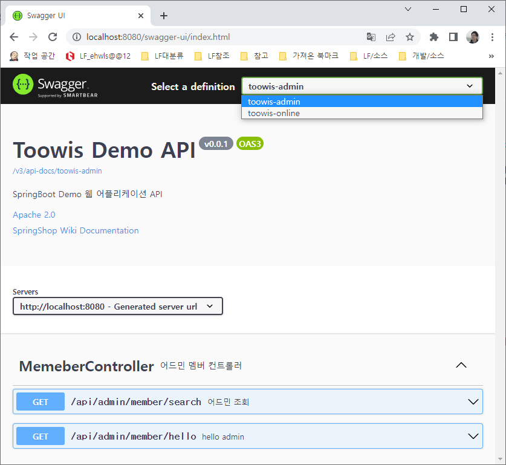

# open api 3.0

open api 3.0 예제

---

### 실행
* http://localhost:8080/swagger-ui/index.html

### 기타
* 참고: [migrating-from-springfox](https://springdoc.org/migrating-from-springfox.html)
* 참고: [blog.jiniworld.me](https://blog.jiniworld.me/83)