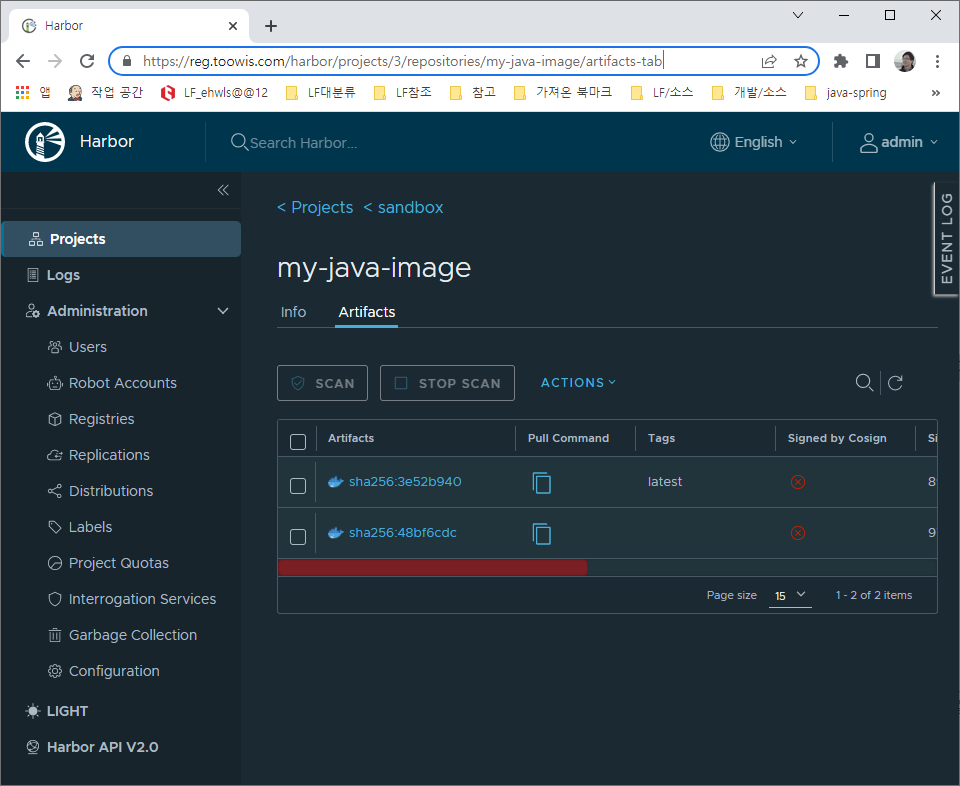

# Jib builds optimized Docker and OCI images

[Jib](https://github.com/GoogleContainerTools/jib)는 자바 어플리케이션을 컨테이너화 할 수 있는 오픈소스 기반 도구이다.  
도커 설치, 도커 데몬 실행, 도커 파일 작성을 일일이 할 필요 없이 Maven이나 Gradle에서 빌드하면 컨테이너 환경에 맞게 자바 어플리케이션을 만들 수 있다.


이미지 생성 과정  


---

### push image to harbor
```sh
mvn compile com.google.cloud.tools:jib-maven-plugin:1.0.0:build \
           -Dimage=reg.toowis.com:443/sandbox/my-java-image:latest \
           -Djib.to.auth.username=admin \
           -Djib.to.auth.password=Harbor12345
           
또는 pom 설정으로
mvn compile jib:build

```



### 실행
```sh
docker run -d --name my-java-image -p 80:7070 reg.toowis.com/sandbox/my-java-image

docker run -it --rm -e JAVA_TOOL_OPTIONS="-Dlogging.file.path=/var/log" \
                    -e SPRING_PROFILES_ACTIVE="local" \
                    -v "E:/docker_volumn/temp:/var/log" \
                    -p 80:7070 reg.toowis.com/sandbox/my-java-image:latest
```

* http://localhost/message


### 기타
* 참고: [jib-maven-plugin GoogleContainerTools](https://github.com/GoogleContainerTools/jib/tree/master/jib-maven-plugin)
* 참고: [blog-serverless-jib2](https://gc.hosting.kr/blog-serverless-jib2/)

