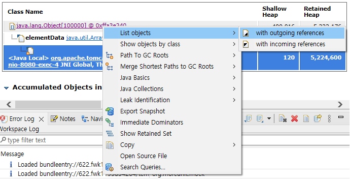

# heap dump

힙덤프 발생과 분석 하는 법

---

### 준비
Eclipse Marketplace... > eclipse memory analyzer

### 실행
```
VM Arguments
-Xms16m -Xmx16m -XX:+HeapDumpOnOutOfMemoryError -XX:HeapDumpPath=E:/heap-dump/jvm.hprof
```
* http://localhost:8080/generate/100000

### 기타
* Xms16m Xmx16m 힙메모리 작은 용량으로 실행
* Xms, Xmx는 힙 시작과 최대치 용량이다. 운영시 보통 같은 사이즈로 맞춘다.
* [perfectacle github](https://perfectacle.github.io/2019/04/28/heap-memory-analytics-with-eclipse-mat/)

### 참고 이미지





